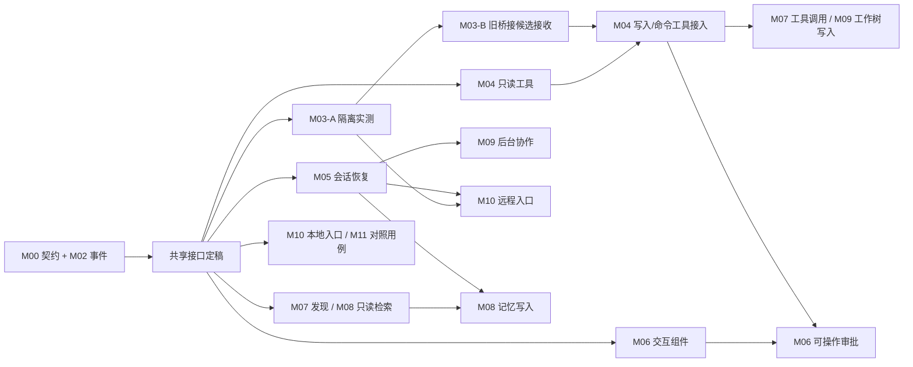

# Mewcode → Stable 迁移地图（调研稿）

> 2026-10-01 建立，2026-10-02 优化并行实施顺序。本文是经 M00 规划确认的迁移范围与实施顺序地图，不替代各子项目的 `spec.md → plan.md → task.md → checklist.md` 审批；M01–M11 的运行实现均须单独审批。

## 已确认的方向

- 尽可能迁移 mewcode 的全部用户功能，而不是只换 TUI 外观。
- Stable 采用统一执行流程：普通任务直接运行通用 agent；长期目标调用同一套 agent 执行能力，并在外层持续调度、保存目标事实和独立验收。两者共用终端界面。
- 首发平台继续限定 Linux。
- 不要求兼容现有 Stable 数据格式和旧命令；这不等于现在删除已有数据。
- 迁移期间允许移除现有长期目标实现，再基于统一执行流程重建；不要求旧目标功能持续可用。
- M00 只制定统一执行契约并修订迁移规划；可运行能力从后续子项目开始交付。
- 普通任务和长期目标都先在隔离候选区修改，经检查后接收。普通任务无预设验收标准时，先运行适用检查，再由用户审阅差异并确认接收。
- 用户可明确确认后强制接收候选，包括检查失败、越界、未授权或版本冲突；agent 不能自行强制接收。长期目标即使被人工强制接收，也保持未验证并重新安排复核。
- 先确认完整迁移地图，再逐个子项目走规格、实现与验收。

## 当前差异与可行性

| 方面 | Stable 当前状态 | mewcode 当前状态 | 判断 |
| --- | --- | --- | --- |
| 终端界面 | Bubble Tea 三栏，会话、聊天、全局目标；约 500 行主模型 | Bubble Tea 单列对话，输入框、滚动视窗、Markdown、状态栏、弹窗；约 4500 行主模型 | 底层 UI 库兼容，交互组件可迁移；主模型不能整文件直接替换 |
| 消息入口 | TUI 经 Unix socket 请求长期服务，收到完成标记后刷新 | TUI 在进程内直接驱动 agent 的流式事件 | 需要统一事件视图，让同一执行流程的流式输出、目标状态和验收结果可见 |
| 核心语义 | 持久目标、验收条件、证据、Temporal、KiCad 独立检查 | 通用 coding agent 的会话、工具、权限与扩展 | agent 执行能力共用；长期目标在外层管理调度与独立验收，工具结果不能自动成为达标证据 |
| 执行安全 | 路线图要求正式产物只读、隔离候选区和独立复检 | 具备权限规则与可选命令沙箱，可直接编辑工作目录 | 已决定两类任务都使用隔离候选与检查后接收；源端直接写工作区的行为须适配 |
| 验证基线 | `internal/tui` 单测通过；会话服务测试在当前沙箱中因无法监听端口而中断 | 命令模块单测通过；TUI 依赖未缓存，当前环境无法离线编译 | 迁移前要补齐可复现的构建环境并取得源端测试基线 |

mewcode 的 TUI 主文件直接引用二十多个内部模块，涵盖模型、工具、权限、MCP、技能、记忆、团队、工作树等。完整迁移可按功能推进，不能把 TUI 文件当作独立组件复制。

统一执行关系：普通任务直接交给 agent；长期目标由 Stable 持续派发工作项给同一套 agent 执行能力。两类执行记录都能在 TUI 查看，两类修改都先产生隔离候选并经检查后接收；用户可明确强制接收，但长期目标的达标结论只由后续独立复检改变。这里的“同一套”指共用执行实现与工具边界，并不要求不同任务共用一个会话或进程。

## 功能清单与子项目

| 子项目 | mewcode 现有能力 | Stable 现有能力 | 迁移方式与可观察交付 |
| --- | --- | --- | --- |
| M00 统一执行契约 | 通用 agent 的会话、事件与配置 | 目标/证据为核心；旧设计原则曾限制执行器按需生长 | 已定义普通任务与长期目标如何调用同一 agent 执行能力、界面如何呈现目标状态；修订冲突的路线图与设计原则并保留源端功能清单 |
| M01 共用 TUI 外壳 | 单列对话、滚动、Markdown、动态多行输入、状态栏、快捷键、斜杠补全、文件 `@` 补全、弹窗 | 三栏目标/会话/聊天，单行输入，目标提案确认 | 移植可独立复用的渲染与输入交互；同一会话界面能发起普通任务、关联长期目标，并可见提案、状态和证据摘要 |
| M02 模型与流式对话 | Anthropic、OpenAI、兼容接口；增量文本/思考/工具事件、用量和错误分类 | 可配置模型的请求式聊天与目标决策；没有 agent 流式 TUI | 接入供普通任务与长期目标复用的流式 agent 执行与取消；目标状态仍由 Stable 持久事实更新 |
| M03 权限、隔离与旧桥接受控接收 | 权限模式、规则、工具许可弹窗、可选系统沙箱 | 目标授权范围；旧 KiCad/电脑桥接仍有独立执行路径 | 建立不可绕过的 Linux 隔离与共用权限边界；旧桥接迁入隔离候选、检查预览、用户接收和独立复核闭环；后续可改文件/执行命令的能力以此为前置 |
| M04 基础工具 | 读写编辑文件、搜索、列目录、命令、diff、工具搜索、媒体输入 | 固定桥接能力；尚无通用 coding 工具循环 | 逐类接入并记录工具调用、结果、失败与预算；通用工具复用 M03 的权限、隔离和受信接收边界，目标工作流只能通过受控执行入口使用工具 |
| M05 会话与上下文 | 持久会话、搜索恢复、输入历史、压缩、文件快照和 rewind | 项目会话日志、目标事实、聊天上下文压缩 | 复用或转换可移植的会话能力；恢复后上下文与界面一致，rewind 仅作用于明确归属的 agent 工作区 |
| M06 计划与任务交互 | plan 模式、审批弹窗、todo、提问弹窗、自定义斜杠命令 | 目标提案确认、用户纠偏和回复 | 让通用 agent 的计划、任务和提问可操作；目标提案与独立验收保持独立标识和状态 |
| M07 外部扩展 | MCP、skills、hooks、命令扩展 | 无同等通用扩展面 | 迁移发现、配置、调用、失败反馈与热更新；扩展工具遵循 M03 的权限和隔离边界 |
| M08 记忆 | 指令发现、自动记忆、检索、提取和整理 | 会话压缩与持久目标事实 | 记忆只能给通用 agent 提供上下文；目标、证据与验收结论仍由 Stable 的持久事实维护 |
| M09 并行协作与工作树 | 子 agent、团队、协调器、后台任务、工作树 | Temporal 管理目标工作流；未提供 mewcode 式通用子 agent | 迁移通用 agent 协作与进度呈现；共享写入受控，不能绕过目标候选接收和独立复检 |
| M10 其他入口 | 非交互 print、WebSocket remote、提供者选择 | Linux CLI、运行时服务、目标命令 | 为通用 agent 提供对应入口；远程权限与本地 TUI 等价，目标状态同样可见 |
| M11 全量对照验收 | 上述能力的组合 | 长期目标持续运行、证据失效与复核 | 逐项对照源端行为，演示普通任务与长期目标调用同一 agent 执行能力；目标持续调度、失效和复核仍正确 |

源端目录归属核对（对照当前 `internal/` 子目录）：`tui`→M01；`llm`、`conversation`、`agent`、`prompt`→M02/M04/M05；`permissions`、`sandbox`→M03；`tools`、`toolresult`→M04；`session`、`history`、`filehistory`、`compact`→M05；`commands`、`planfile`、`todo`→M06；`mcp`、`skills`、`hooks`→M07；`memory`→M08；`agents`、`teams`、`worktree`→M09；`remote`、`config`、`crashlog`→M10。命令入口 `cmd/mewcode` 的交互、print 与远程启动行为按 M10 归属。跨项目目录按行为归属拆开验收，不能只以文件复制完成判断。

### M09 当前进度（2026-10-08）

M09-A（同步只读协作）、M09-B（fork skill）、M09-C（hook agent）和 M09-D（agent 定义与后台任务 AC1–9）已完成实现与验收；M09-E/F 已实现并提交，但仍有逐项验收缺口，**M09 整体仍未完成**。最新代码验证 SHA `35b130bcdc73f806fbba80e57258d5944b80e7e4` 的 Go build/unit、package、全量 E2E 与 M09 Workspace Linux 全部通过：[Go run 37826465763](https://github.com/kikoiio/Stable/actions/runs/37826465763)、[E2E run 37826465801](https://github.com/kikoiio/Stable/actions/runs/37826465801)、[Workspace Linux run 37826465661](https://github.com/kikoiio/Stable/actions/runs/37826465661)。此前 apt mirrorlist 选到 Azure HTTP 源导致 setup jobs 挂起，CI action 修正为官方 HTTPS 源后复验通过。

完整源端对照、已通过证据和剩余完成条件见 [M09 范围与进度](specs/M09/README.md)。D/E/F 的规格均已批准；总体验收以各自 checklist 中的证据和未完成项为准。

## 并行实施顺序与依赖

将“可以开始设计或独立开发”与“可以接入共享执行并向用户开放”分开判断。M00 契约和 M02 的运行事件是共同输入；先为工具调用/结果、权限决定、隔离候选、检查预览与接收确定跨模块接口及唯一负责人，再按下表并行推进。各子项目仍须分别完成自己的规格、设计、任务和验收；本表不提前批准运行实现。

| 并行工作流 | 可立即推进的最小交付 | 接入或开放的硬门槛 |
| --- | --- | --- |
| 安全与执行（M03、M04） | M03-A 选定并实测隔离边界；M03-B 将旧桥接迁入候选、检查预览、用户接收和目标复核；M04 并行开发只读工具、工具协议、fake 执行器和场景用例 | M03-B 依赖 M03-A；M04 的写入和命令接入须等 M03 的安全与受信接收闭环验证；正式产物仅经受信接收改变 |
| 会话与交互（M05、M06） | M05 开发搜索、上下文投影、压缩与恢复；M06 开发计划、todo、提问的状态和界面组件 | M06 的可操作工具/审批流程等 M04 工具结果及权限协议接入；后台运行须等 M05 恢复验证 |
| 扩展与记忆（M07、M08） | M07 开发发现、配置和失败反馈；M08 开发指令发现与只读上下文检索 | MCP/扩展工具调用须走 M03+M04 的权限和隔离边界；记忆写入/恢复须使用 M05 的会话语义，不能修改目标事实 |
| 协作与入口（M09、M10） | M09 开发协作事件与只读协调原型；M10 开发本地 print/提供者入口 | 工作树写入须等 M03+M04 的候选接收链；后台协作须等 M05 恢复；远程入口须等 M03 权限边界与 M05 恢复，并另行确认访问控制 |
| 对照验收（M11） | 从现在起建立逐功能对照、普通任务/长期目标共用 runner、候选接收和复核的自动化场景 | 最终全量验收须在 M01–M10 的对应能力完成后通过；提前写用例不等于提前宣称功能完成 |

### M03 收尾处置与 M04 衔接（2026-10-04 验收后决定）

M03 已按 checklist C01–C36 完成验收（真实隔离、强制接收、中断恢复均有真环境证据）。四项残留的处置：

1. **唤醒重放**：**已解决（2026-10-04）**。定位为测试收敛判定竞态而非产品回归；dependency_change 尾部三阶段已恢复并以稳定收敛条件（连续 3 次读数）跑绿。M04 写入/命令接入的原追加门槛解除。
2. **会话转向语义**：转为产品决策项，作为 **M05 规格轮的输入**（conversation/agent 在统一 agent 运行器下的 say/reply 语义）。本里程碑不做实施。
3. **会话代次外部可观测性**：取消。语义已由 TestM03ComputerIsolatedSessionLifecycle 覆盖，run.sh 断言已按 M03 语义注明。
4. **tests/cases 案例运行器**：挂起。`agentctl start` 移除属 M03 前既有欠账，S01 运行器待工具场景成形后按会话绑定目标 + 接收流程重写。
5. **schema 中间版本连续迁移用例**：挂起（低优先），随后续触碰 store 的里程碑顺带补。

M04 启动安排：**只读工具轨道（工具协议、fake 执行器、场景用例）与上述残留无文件耦合，可立即开工**；写入/命令工具接入按原表门槛执行（M03 安全与受信接收闭环已验证）。

优先推进的两条汇合路径是“M03-A 隔离实测 → M03-B 旧桥接受控接收 → M04 通用写入/命令工具接入”和“会话恢复 → 后台协作/远程入口”；M04 只读工具可与 M03 并行开发。M11 可同步积累用例，最终仍需 M01–M10 对应能力全部完成。M01 清单中的共用界面外壳已通过自动化检查，仍有真实终端场景待复核；M02 的流式事件和共享 runner 可作为并行工作的接口基线，但当前工具调用只记录并停在 `awaiting_tools`，不算工具执行已完成。M05 接入时须统一旧会话压缩与新流事件的 transcript 语义，避免恢复或压缩后丢失事件。每个超过一个 2–5 工作日周期的子项目，应拆成可单独演示的小项；只在硬门槛通过后开放依赖该能力的入口。

### 并行开发与集成约束

- 共享接口和 `internal/agent`、`internal/conversation` 等交叉文件指定单一负责人；其他工作流先依契约、fake 和 fixture 开发，在小集成点合并。当前工作树含 M01/M02 未提交改动，独立工作流使用隔离工作树并明确基线，避免覆盖彼此的实现。
- 每个工作流独立验证自己的包与场景；合并时执行统一 runner、候选接收、目标独立复核和会话恢复的跨模块回归。用户强制接收仍由受信控制面执行，目标保持未验证直至独立复核通过。
- 测试提速先消除固定端口和共享运行目录：端到端脚本分配独立端口，Go 二进制构建一次后供各场景使用，再并行运行独立的 e2e/场景用例。CI 保留快速 Go 构建与单测，并为集成、打包和双目标并行场景设置独立检查；未满足端口隔离前不直接并发运行现有脚本。

## 实施方案比较

1. **已选：按能力迁移，形成统一 agent 执行层和共用界面。** 可直接复用纯渲染、输入、命令解析等局部代码；agent 核心、事件、存储和安全边界按 Stable 契约接入。改造量较大，但普通任务与长期目标可以复用同一执行能力并逐项验收。
2. **并列嵌入 mewcode，再整合执行层和界面。** 可以较快得到通用 agent 的独立入口；短期会有两套配置、会话和权限，之后还要合并执行路径与界面，迁移债务较高。
3. **整包替换 Stable。** 初期复制速度最快，但会丢失或旁路目标、证据、Temporal 和独立验收，不能满足已选定的产品定位。

## 后续子项目仍需逐项确认的边界

- M10 的远程入口仍须在自己的 spec 中确认访问控制、模型凭据和工作目录授权，不能沿用本地 TUI 的隐含信任。
- 各子项目应在自己的 spec 中确认具体行为、验收和兼容细节；本图只确定整体归属与推荐顺序。

## 调研依据与限制

- Stable：`cmd/stable/main.go`、`internal/tui/model.go`、`internal/conversation/`、`internal/core/types.go`、`docs/spec_docs/design-principles.md`、`docs/spec_docs/vision-roadmap.md`。
- mewcode：`cmd/mewcode/main.go`、`internal/tui/`、`internal/agent/`、`internal/tools/`、`internal/permissions/`、`internal/sandbox/`、`internal/commands/`、`internal/session/`、`internal/mcp/`、`internal/skills/`、`internal/memory/`、`internal/teams/`、`internal/remote/`。
- 当前 mewcode 目录不是可用的 Git 仓库，无法从中核对提交历史；本地图谱以当前文件快照为准。
- 当前沙箱不允许创建监听套接字，且缺少部分 mewcode Go 依赖缓存；这些环境限制尚未证明源端测试失败。
