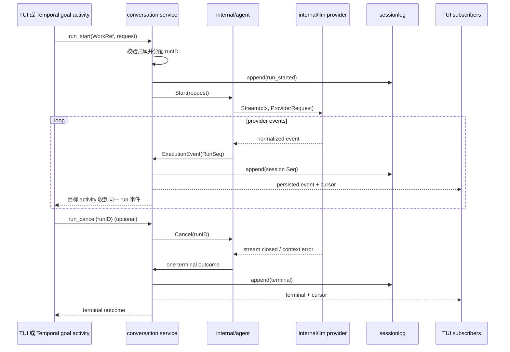

# M02 模型与流式对话 Plan

## 架构概览

M02 在 Stable 现有会话服务前增加流式运行路径。`internal/llm` 负责把 Anthropic、OpenAI 与 OpenAI-compatible 的 HTTP/SSE 响应转换成 provider-neutral 事件；`internal/agent` 是普通任务和长期目标工作项共用的单一 runner，维护运行状态、取消、重试与事件顺序，但不执行工具。现有 `internal/decision` 保持独立，继续承担 Gemini 等结构化目标决策。

`internal/conversation` 作为唯一运行编排与会话事件入口：接受 TUI 或 Temporal worker 的 run 请求，将其提交给共享 runner；先将规范化事件追加到 `internal/sessionlog`，再广播给相应客户端。TUI 通过现有 Unix socket 协议消费事件、恢复游标并发起取消。Temporal goal activity 通过同一 Unix socket 请求目标工作项运行并等待结果；目标状态、候选、验收和证据仍由 Stable 控制面维护。

配置继续由 `internal/appconfig` 加载。conversation service 与 agent worker 在进程装配层取得同一模型配置；provider streaming factory 与 `internal/decision` 的结构化 provider factory 分离。服务端持久事件游标采用 sessionlog 现有会话级 Seq；每个运行另有独立递增 RunSeq，满足单 run 排序与会话重连读取两种用途。

## 核心数据结构与接口

### `WorkRef`

```go
type WorkKind string

const (
	WorkSession WorkKind = "session"
	WorkGoal    WorkKind = "goal"
)

type WorkRef struct {
	Kind       WorkKind `json:"kind"`
	SessionID  string   `json:"session_id"`
	GoalID     string   `json:"goal_id,omitempty"`
	WorkItemID string   `json:"work_item_id,omitempty"`
}
```

`Kind` 与 ID 组合用于归属校验和事件过滤。普通任务只填 session；目标工作项同时填目标与工作项 ID，并归属到会话。工作项的目标状态不从模型事件推导。

### `ExecutionRequest`

```go
type ExecutionRequest struct {
	RunID            string
	Work             WorkRef
	Intent           string
	Messages         []ConversationMessage
	ProviderName     string
	Model            string
	BaselineVersion  string
	AllowedScope     []string
	ResourceBounds   json.RawMessage
	PermissionBounds json.RawMessage
}
```

普通任务和目标工作项共用此输入。基线、允许范围、资源限制和权限边界承接 M00 契约；M02 保留并传递这些信息，但不据此实现文件操作、工具授权或隔离区。`Messages` 是本次 provider 请求的上下文，不是第二套会话持久化。

```go
type ConversationMessage struct {
	Role    string `json:"role"` // system | user | assistant
	Content string `json:"content"`
}

type ProviderRequest struct {
	Model       string
	Messages    []ConversationMessage
	MaxTokens   int
	Temperature *float64
}
```

资源和权限边界以 JSON opaque payload 从 M00 控制面传递；M02 不解释、不扩大它们。`ProviderRequest` 只含发送给模型的消息与生成参数，不含 API key；密钥仅由 provider 实例从配置读取。

### `ExecutionEvent`

```go
type EventKind string

const (
	EventRunStarted      EventKind = "run_started"
	EventTextDelta       EventKind = "text_delta"
	EventThinkingDelta  EventKind = "thinking_delta"
	EventThinkingDone   EventKind = "thinking_complete"
	EventToolCallStart  EventKind = "tool_call_start"
	EventToolCallDelta  EventKind = "tool_call_delta"
	EventToolCallDone   EventKind = "tool_call_complete"
	EventUsage          EventKind = "usage"
	EventRetry          EventKind = "retry"
	EventError          EventKind = "error"
	EventTerminal       EventKind = "terminal"
)

type ExecutionEvent struct {
	ID        string
	RunID     string
	SessionID string
	RunSeq    uint64
	At        time.Time
	Kind      EventKind
	Payload   json.RawMessage
}
```

`ID` 对单个事件稳定唯一；`RunSeq` 从每次运行的 1 开始严格递增。追加到 sessionlog 后，外层 `sessionlog.Event.Seq` 作为 session 级持久游标。事件类别包括 `run_started`、`text_delta`、`thinking_delta`、`thinking_complete`、`tool_call_start`、`tool_call_delta`、`tool_call_complete`、`usage`、`retry`、`error` 和 `terminal`。未知类别保留为可跳过事件，不阻断客户端读取。

### `UsageInfo` 与 `ToolCall`

```go
type UsageInfo struct {
	InputTokens         *int `json:"input_tokens,omitempty"`
	OutputTokens        *int `json:"output_tokens,omitempty"`
	CacheReadTokens     *int `json:"cache_read_tokens,omitempty"`
	CacheCreationTokens *int `json:"cache_creation_tokens,omitempty"`
}

type ToolCall struct {
	ID        string          `json:"id"`
	Name      string          `json:"name"`
	Arguments json.RawMessage `json:"arguments,omitempty"`
	Complete bool            `json:"complete"`
}
```

用量的可选值区分真实的零与 provider 未报告。工具参数在增量事件中可为 JSON 片段；完成事件携带完整、已解析的 JSON。事件仅供显示与持久化，不触发执行。

### `RunOutcome` 与 runner/provider 接口

```go
type RunStatus string

const (
	RunCompleted     RunStatus = "completed"
	RunCancelled     RunStatus = "cancelled"
	RunFailed        RunStatus = "failed"
	RunAwaitingTools RunStatus = "awaiting_tools"
)

type RunOutcome struct {
	RunID  string
	Status RunStatus
	Error  *ProviderError
}

type RunHandle struct {
	Events <-chan ExecutionEvent
	Done   <-chan RunOutcome
}

type ProviderError struct {
	Class      string // auth | rate_limit | network | context_limit | provider
	Message    string // sanitized, safe for transcript/logging
	RetryAfter time.Duration
	Retryable  bool
}

type ProviderEvent struct {
	Kind    EventKind
	Payload json.RawMessage
}

type Provider interface {
	Stream(context.Context, ProviderRequest) (<-chan ProviderEvent, <-chan error)
}

type Runner interface {
	Start(context.Context, ExecutionRequest) (*RunHandle, error)
	Cancel(runID string) error
}
```

`RunHandle` 提供按序读取的事件流和一个唯一终态。runner 对 provider 事件归一化、分配 RunSeq、保留已输出文本并将 context 取消向下传递。认证、限流、网络、上下文超限和普通 provider 错误由 `ProviderError` 分类；工具调用未执行时以 `awaiting_tools` 收束，不得报告 completed。

## 模块设计

### `internal/llm`

**职责：** 定义 provider-neutral 请求、事件、用量和错误类型；适配 Anthropic、OpenAI、OpenAI-compatible SSE；处理文本、思考、工具参数增量、结束原因和 provider 用量；安全解析错误响应并对凭据脱敏。

**对外接口：** `NewProvider(ModelConfig)` 返回 `Provider`；`Provider.Stream(ctx, request)` 输出有序事件与错误。内部协议实现不可向 agent 或 TUI 暴露原始 SSE 格式。

**依赖：** Go 标准库 HTTP、SSE 解析及现有 appconfig 类型；不依赖 TUI、conversation、core 或 sessionlog。

### `internal/agent`

**职责：** 实现唯一 run 状态机和 registry；调用 provider，规范化/排序事件，管理取消和有限重试，保留部分结果，确保 completed/cancelled/failed/awaiting_tools 终态互斥。

**对外接口：** 实现 `Runner.Start` 与 `Runner.Cancel`；返回 run handle。通过注入的事件发布端将事件交给 conversation service 持久化。

**依赖：** `internal/llm` 与 M00 逻辑执行契约类型；不依赖 conversation、sessionlog、TUI、Temporal 或具体工具执行器。

### `internal/sessionlog`

**职责：** 增加 run_started、流式 delta、usage、retry、error、terminal 等事件负载与校验。保留现有每 session 递增 Seq；按 append 次序提供事件游标读取。

**对外接口：** 沿用当前 append/read API，扩展事件类型及数据校验；由会话服务在持久追加时取得 session cursor。

**依赖：** 仅标准库事件格式，不依赖 agent 或 provider 实现。

### `internal/conversation`

**职责：** 扩展 Unix socket 协议以启动 run、订阅/回放事件和取消 run；校验 run/session/WorkRef 归属；创建 runID；协调 runner、sessionlog 与订阅者。仅在事件成功持久化后广播。慢订阅者队列溢出时发送可观察的 resync/cursor 信号或断开该订阅，不能静默跳过事件。

**对外接口：** 既有 session/chat API 保持可用；新增 run start、run cancel 和带 cursor 的 run event 消费语义。目标 worker 使用同一 socket 和同一 run 路径。

**依赖：** `internal/agent`、`internal/sessionlog`、现有 `internal/core` 及持久 store；不直接解析 provider 协议。

### `internal/core` 与 `cmd/agentworker`

**职责：** 在既有 Temporal 控制流中将目标工作项映射为 `WorkRef{Kind: goal}` 和 `ExecutionRequest`，经本机 conversation service 启动共享 run 并等待唯一 outcome。仍由 Stable activity 写目标状态、工作项状态、候选/验收证据和下一责任；运行完成或模型自述不构成验证。

**对外接口：** 通过注入的 `GoalRunClient`（本地 socket client）调用 start/stream/cancel，不在 worker 中实例化第二份 agent runner。

**依赖：** 现有 Temporal、store、decision 与 conversation 协议；结构化目标决策继续使用 `internal/decision`。

### `internal/appconfig` 与 `internal/runtime`

**职责：** 沿用 `ModelConfig`、私有配置权限和环境变量密钥覆盖；在 supervisor/service/worker 装配时构造 streaming provider 与共享 runner。将 conversation socket 地址传给 agentworker。诊断和日志仅输出 provider/model/host 等非秘密摘要。

**依赖：** `internal/llm`、`internal/agent`、现有 `internal/decision` 与 runtime 生命周期管理。

### `internal/tui`

**职责：** 消费带 run/session 归属和游标的事件；增量更新文本、独立思考区、工具调用生命周期、用量、重试、错误和终态；提供当前 run 的取消操作；断线后以持久游标请求补发或刷新 transcript。未知事件忽略。

**依赖：** conversation socket 客户端协议、`sessionlog.Transcript` 与当前 Bubble Tea 视图模型；不直接依赖 provider 或 agent 包。

## 模块交互



TUI 与 Temporal activity 都经 conversation service 提交请求，因此不会创建各自的 runner。服务先追加再广播；sessionlog Seq 支持恢复，RunSeq 支持单 run 连续性检查。目标 activity 在运行结束后将 outcome 交回 Stable 控制流，只有 Stable 的既有验收步骤能改变目标验证事实。若 provider 返回 tool-call，agent 持久化并呈现调用后以 `awaiting_tools` 终止，M04 再补执行与结果回填。

## 文件组织

```text
internal/
├── agent/
│   ├── runner.go                 — Runner、RunHandle 与唯一状态机
│   ├── registry.go               — 活跃 run、取消与归属
│   ├── events.go                 — ExecutionEvent、RunOutcome 与事件规范化
│   └── runner_test.go            — fake provider 的顺序、终态、取消、重试测试
├── llm/
│   ├── provider.go               — provider-neutral Provider 与请求/事件类型
│   ├── factory.go                — 根据 appconfig 创建 streaming provider
│   ├── anthropic.go              — Anthropic SSE 适配器
│   ├── openai.go                 — OpenAI SSE 适配器
│   ├── compatible.go             — OpenAI-compatible SSE 适配器
│   ├── sse.go                    — 可取消、可诊断的 SSE 解码
│   ├── errors.go                 — 错误分类、Retry-After 和脱敏
│   └── *_test.go                 — fixture/fake server 协议和异常测试
├── sessionlog/
│   ├── events.go                 — 新增 run event payload 类型
│   ├── log.go                    — payload 校验及按 session cursor 读取
│   └── log_test.go               — schema、顺序、回放和旧事件回归
├── conversation/
│   ├── protocol.go               — run start/subscribe/cancel 消息与校验
│   ├── service.go                — agent 装配、持久化后广播、订阅和回放
│   ├── client.go                 — 流式事件及取消客户端
│   └── *_test.go                 — 并发归属、断连/补读和 socket 集成测试
├── core/
│   ├── activities.go             — goal work item 通过注入 client 使用统一 runner
│   └── activities_test.go        — goal outcome 与验证状态边界
├── appconfig/
│   ├── config.go                 — provider 配置验证与密钥来源/脱敏约束
│   └── config_test.go            — streaming 配置和诊断回归
├── runtime/
│   └── supervisor.go             — provider/runner 装配及 worker socket 参数
└── tui/
    ├── model.go                  — run 事件消费、cancel、终态状态
    ├── transcript.go             — text/thinking/tool/usage 流式呈现
    └── *_test.go                 — 事件顺序、分区、用量和取消展示

cmd/agentworker/
├── main.go                       — 注入目标 run socket client
└── main_test.go                  — worker 装配/取消回归

specs/M02/
├── spec.md
├── plan.md
├── task.md                       — 后续阶段生成
└── checklist.md                  — 后续阶段生成
```

测试文件以目录内现有命名风格落位；若实现中发现当前入口文件可容纳小型类型定义，可合并同目录文件，但不得改变模块依赖方向或事件契约。

## 技术决策

| 决策点 | 选择 | 理由 |
| --- | --- | --- |
| provider 配置与密钥 | 沿用 `appconfig.ModelConfig`、私有文件权限和既有环境变量覆盖；不增加密钥存储 | 保持当前 Linux 首发配置体验；减少密钥复制面，满足凭据不进入 transcript/log 的要求。 |
| provider 协议实现 | 逐协议隔离适配；参考并选择性移植 mewcode 代码，采用标准库 HTTP/SSE 与 fixture 测试 | 能复用成熟协议处理，同时避免引入 provider SDK 和 mewcode 主 agent 耦合。 |
| Gemini 结构化决策 | 保留 `internal/decision` 原路径，不把 streaming 改造混入该层 | 目标决策已有稳定结构化 schema 和回归测试，M02 不需要破坏该能力。 |
| 执行入口 | conversation service 持有单一 runner；TUI 和 Temporal worker 都通过其本机 Unix socket 提交 | 对齐 M00 的共用 agent 契约，并适配当前 worker 与 conversation service 分进程的 runtime。 |
| 事件序号 | sessionlog 全局 Seq 作为持久游标；ExecutionEvent.RunSeq 在每个 run 内严格递增 | 两种序号分别服务 session 回放和单 run 连续性检查，避免把 run 顺序误当成 session 顺序。 |
| 事件广播背压 | 持久化先于广播；慢订阅者收到 cursor/resync 信号或被断开后补读 | runner 不受 UI 慢消费影响，同时禁止静默丢事件。 |
| 重试 | 只重试限流/网络类可恢复错误；有最大次数、总等待上限并尊重 Retry-After | 避免认证/参数错误重复请求，并确保重试资源可预测。 |
| tool-call | M02 解码、记录、显示但不执行；出现未完成的工具需求时终态为 awaiting_tools | 将模型请求与受控执行权限分开，后续由 M03/M04 接入。 |
| 普通任务与目标事实 | 同一 run/stream；Stable 仍是目标状态、证据与复核责任的唯一权威 | 防止 agent 文本、取消或运行成功越权改变长期目标结论。 |

## Spec 覆盖关系

| Spec 项 | Plan 落点 |
| --- | --- |
| F1、N1 | `internal/appconfig`、`internal/runtime`、`internal/llm` 与凭据脱敏决策 |
| F2、AC2 | `WorkRef`、`ExecutionRequest`、共用 runner 及 goal socket adapter |
| F3、N2 | `ExecutionEvent`、RunSeq/session Seq、provider 适配和回放 |
| F4 | TUI 模块及按 run/session 过滤的 conversation 广播 |
| F5、N3 | Runner registry、context 取消、唯一终态与 TUI cancel |
| F6、N4 | `ProviderError` 分类、有限重试及部分文本保留 |
| F7 | tool-call 事件与 `awaiting_tools` 终态；明确不调用工具执行器 |
| F8 | 可选字段 `UsageInfo` 与 provider 用量归一化 |
| F9、AC8 | sessionlog 持久追加、socket 游标回放及 transcript 重载 |
| N5 | `internal/decision` 保持 Gemini 结构化决策路径 |
| N6、AC10–AC11 | fake provider/SSE fixture、socket 集成及 Linux 本地测试 |
