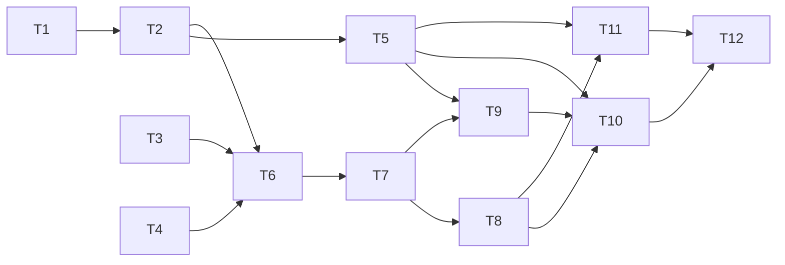

# M09-D Agent 定义与后台任务 Task

> 状态：四份文档已获用户批准，正在实现（2026-10-07）。验收项取得实际证据后勾选。

## 任务与验证

| ID | 文件与步骤 | 依赖 | 定向验证 |
|---|---|---|---|
| T1 | 创建 `internal/agentcatalog/definition.go`：frontmatter 字段、名称/model/tools/maxTurns 校验、正文限额、拒绝 unknown fields 与符号链接 | 无 | 临时文件表驱动测试覆盖合法定义、空值、未知字段、过长数据和链接 |
| T2 | 创建 `catalog.go`：三个内建角色、用户/项目覆盖、稳定排序、完整快照重载、公开元数据剔除正文 | T1 | 同名覆盖、有效项与错误项共存、删文件后重载和并发读快照 |
| T3 | `agent/delegation.go` 增加 SubmitTask/handle，RunTask 复用；保留 RunBatch Session-only/背压；单项预算只能收窄 | 无 | 屏障验证成功提交、queue full、provider 从未在拒绝时调用、取消/关闭竞争、FIFO、A/B/C 原测试 |
| T4 | `sessionlog` 增加来源字段和任务/通知投影契约；定义合法状态和 terminal/通知去重键 | 无 | 合法/非法来源、长度、终态不可变、重复/跨 session 事件和投影/游标续读 |
| T5 | `conversation/agent_catalog.go` 与 protocol 增加列表/重载接口；只从受信 roots 加载 | T2 | 真实 service socket fixture 列元数据、热重载、拒绝跨项目输入，不读真实目录 |
| T6 | `conversation/agent_tasks.go` 构造作用域、任务正文、独立 run 和 active cancellation handle；同步/后台分派 | T2、T3、T4 | fake provider 捕获输入/model/root，成功接受立即返回、同步等待、拒绝输入与写盘失败 |
| T7 | 实现 task list/get/wait/stop、OriginRunID 父取消、service.Close 和 terminal 持久化 | T6 | 双父/双 session 屏障：独立/父取消、另一批不受影响，正常父终态与断线继续，等待30秒截断/取消 |
| T8 | `agent_task_recovery.go`、delegation recovery 接入；完成通知的持久投影和下一次 run 交接 | T7 | 首 queued 前、queued、running、child terminal/run gap 四处中断；恢复两次无重跑/重复终态；通知 destination 缺失重放 |
| T9 | execution 父工具 schemas 与 service adapter，factory 注入；tool call/result、hook 顺序保持 | T5、T7 | run_agent 同步/后台、task_output/task_stop、Goal WorkRef、只读 child 无递归工具、权限拒绝在执行前 |
| T10 | runtime/service 绑定并管理关闭；定义目录从 config-root 和 authority 根构造；避免循环依赖 | T5、T8、T9 | fake runtime 配置验证单 pool、单 coordinator、provider 与 factory 注入，关闭取消任务 |
| T11 | client、TUI slash 与列表/查询/取消、独立任务订阅和当前 session 恢复；不覆盖父 run 状态 | T5、T8 | `/agents`/`/agent`/`/tasks` 输入用法、列表与拒绝反馈、双 run 同时呈现、断线cursor恢复、不显示正文/thinking |
| T12 | fake-provider service 集成与 A/B/C 回归，README 和本 checklist 验收记录 | T10、T11 | 队列/预算/失败/取消/重启/通知完整路径；GitHub Actions Go、E2E、package acceptance 并记录链接 |

## 可执行顺序与文件所有权

最大初始独立批次为 T1、T3、T4。T2 和 T3/T4 可继续并行；接入 protocol/service/run、tool_executor 与恢复的文件由主负责人协调串行合并。T5/T6 虽文件主要不同，protocol 类型调整必须先定稿。T9、T11 在接口汇合后可并行；T10 与 T12 为集成汇合。

每个任务做独立定向验证，汇合后执行跨模块回归。主负责人集中调度重型操作；subagent 只负责轻量读取/修改，未计划的构建/安装/大测试须先协调。遵守用户 AGENTS.md 的 MemAvailable/PSI 判断、临时进程清理与云端优先规则。

## 验证执行约定

- 本机优先格式化、`git diff --check` 和 fake 定向小用例；worker/jobs 参数按整机资源设置。出现配额/OOM 先定位，不盲目重跑。
- 重型 CLI/worker 构建、`go test ./...`、E2E、`make test-package` 继续使用本会话已授权的 GitHub Actions；不再重复申请同一 Actions 权限。
- CI 失败时记录失败 run/job 和具体场景；修复后在对应代码提交复验，不能用文档提交或旧提交的成功覆盖新代码。
- 定义来源 fixture 均临时构造；不读真实用户配置，不调用真实 provider，不擅自终止用户进程。

## 完成定义

- T1–T12 完成，AC1–AC9 和 checklist 逐项有证据。
- 定义/后台任务入口形成 UI、父工具、共享 runner、持久事件和恢复的完整闭环，用户可查看并取消真实已接受的 fake-provider 任务。
- A/B/C 和候选/权限/目标事实回归通过，结果不自动成为目标证据或候选接收。
- 状态文件区分 D 完成与整个 M09 的 E/F 尚未完成，不提前宣称 M09 全部结束。
