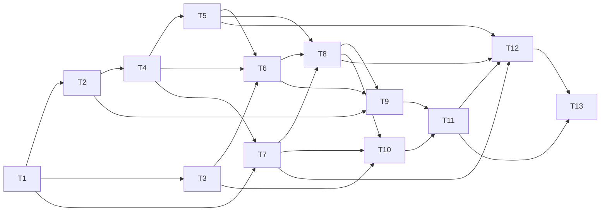

# M09-E 团队、消息与只读协调器 Task

> 状态：已批准，实施中（2026-10-07）。用户批准 M09-E 四份规格文档及其定义的实现范围。以下 DAG 按依赖推进；任务无实际证据前不标记完成。

## 任务与定向验收

| ID | 实施内容/文件 | 依赖 | 定向验证 |
|---|---|---|---|
| T1 | `teams/types,limits,taskgraph`：team/member状态、scope、预算、依赖canonical规则、typed操作 | 无 | 名称/保留lead/状态跳跃、容量、依赖环和双向投影、expected_revision表驱动fixture |
| T2 | sessionlog新增team_event、RunStarted来源、CallID/token、严格身份/revision/terminal去重与流式投影 | T1 | 跨session/WorkRef、非法来源/跳序、损坏replay、请求/消息/terminal幂等、闭合历史分页 |
| T3 | `agent`窄TeamService与受控member-turn input；pool capacity wake和预算收窄 | T1 | 同一3worker/32queue、readonly/team-only schemas、capacity唤醒无busy-loop、A–D兼容 |
| T4 | `conversation/team_service`注册/create/list/get/close起点、受信lead/member身份与额度 | T2 | 两session/Goal/WorkItem、重名/ID伪造/root变更、单实例、多team容量、持久失败不接受 |
| T5 | 持久p2p/lead/broadcast与typed request路由；token幂等和批次投影 | T4 | 固定recipient/全或无广播、recipient64/team256/2MiB、写盘失败、普通shutdown文本无控制效果 |
| T6 | member spawn/turn调度/idle/摘要延续、严格effective tools、生命周期预算 | T3、T4、T5 | 双轮fake输入、一个member不并行、队满首spawn拒绝、后续waiting_capacity公平唤醒、角色重载原快照 |
| T7 | 团队任务create/get/list/update与owner权限、revision CAS、依赖完成门 | T1、T4 | 并发双claim仅一次成功、未完依赖阻塞、跨team拒绝、取消不伪completed、M06 todo独立 |
| T8 | plan-required和shutdown请求/响应/过期、stop/close、parent/service取消 | T5、T6、T7 | approve/reject仍readonly、wrong/stale/conflict响应、busy延期/拒绝/强停、父完成继续/父取消隔离、退出后终态 |
| T9 | 启动恢复、持久handoff与lead上下文、compaction保留、显式resume | T2、T6、T8 | intent→queued→handoff各gap、terminal/run/idle gap、close gap；恢复两次无provider调用；resume保留预算/消息；Goal通知与32KiB批次 |
| T10 | execution团队工具/lead/member/coordinatorhard allowlist、gate/hooks/audit | T3、T7、T8 | 恶意provider直接执行未列schema工具被拒、from/scope伪造无效、gate拒绝先于service、CallID结果配对 |
| T11 | runtime与conversation protocol/client/service/run接入、单scheduler/单pool关闭 | T9、T10 | fake runtime/session socket，stop/关闭竞争、服务关闭清理自身watcher、普通Session/Goal行为不变 |
| T12 | TUI/CLI slash、团队/任务/请求分页、coordinator下一run设置及重连游标 | T5、T7、T8、T11 | 输入用法、两run同时呈现、不覆盖parent、requests反馈、退出coordinator和跨scope详情拒绝 |
| T13 | 完整fake service场景、源行为对照、README/checklist和已授权云端组合回归 | T11、T12 | AC1–9全部可观察证据，Go/E2E/package确切SHA/job与失败历史；明确E完成/F仍待审批 |

## DAG 与调度

先统一T1 scope/事件操作和身份职责。T2/T3文件独立可并行；T5/T7可在T4后分工，协议字段由主负责人集中修改。T9/T10可并行但对handoff/CallID接入统一约定；T11为汇合。T12可预先编写纯输入解析/视图，但service依赖通过后才完成验收。不得同时覆盖events、protocol、run或factory共享文件。

## 执行约定

- 四份文档已获批准；按本DAG实现，不创建终端后端或源配置副本。
- 获批后轻量读取/编辑/fake定向检查按MemAvailable与PSI调度，subagent启动任何未计划重型操作前与主负责人协调。不因swap满直接停止轻量并行。
- 重型构建、全量Go/E2E/package一律优先已授权GitHub Actions，使用fake配置和临时目录；不读真实provider或真实`.mewcode`团队数据。不能用旧代码/文档提交的CI成功证明新E实现。
- 超额、OOM、配额与失败先记录并降低并发/缩小范围，不提高heap或反复盲跑；不得擅自杀其它任务进程或修改swap/系统内存配置。
- 每任务定向证据通过才勾选checklist；云端失败保留run/job与具体修复，再在最新代码提交复验。

## 完成定义

T1–T13全部实现，AC1–AC9和完整场景有运行证据；用户与父agent形成团队→多轮消息→依赖任务→计划/关闭→恢复闭环。A/B/C/D共享池与只读权限、M05事件/compaction、M06 todo、普通Session/Goal及候选/独立目标验收回归通过。文档明确source行为差异及不适用后端，E不能代替F工作树写入验收，也不能提前宣称整个M09完成。
