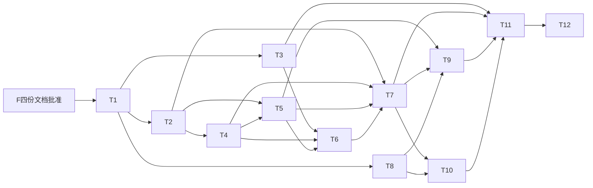

# M09-F 受控工作树与并行写入 Task

> 状态：已批准，实施中（2026-10-07）。用户批准 M09-F 四份规格文档及其定义的实现范围。按下列 DAG 实施；共享接口与 metadata 事务文件由主负责人指定单一所有者。未取得验证证据的任务不得勾选完成。

## 任务表

| ID | 实现范围 | 依赖 | 具体定向证据 |
|---|---|---|---|
| T1 | 定稿 workspace Scope/Snapshot/WriterLease、状态/operation幂等键、generation、protected metadata与manifest policy版本契约；更新F实现状态 | F四文档批准 | 契约表与AC1–9映射一致；定义 session/work/用户discard身份不能来自tool args |
| T2 | `internal/workspace` 安全根/ownership、project-v2 manifest、文件/磁盘配额预留、单materializer和8项队列、原子资源journal | T1 | 临时root验证越界/symlink/hardlink/submodule/特殊文件、快照源变化、总字节/单文件/文件数/项目项数/队列上限 |
| T3 | candidate/store versioned policy、`.git/.stable/.mewcode`保全与事务阶段；accept/rewind/reconcile同一契约，旧digest读与阻断策略 | T1 | 正式`.git`目录/指针、候选metadata注入、旧candidate/确认/事务、保护identity竞争、每个保全/交换/归位点crash恢复 |
| T4 | private bare/合成baseline/checkout，净化Git环境和配置，禁用filter/hooks/remote/alternates/hardlinks；可取消创建 | T2 | 临时恶意Git config、属性/filter/hooks、旧脏正式树、private refs、source变更和创建partial rollback；正式Git字节/refs/index不变 |
| T5 | writer单租约、可信authority、protected path gate、workspace文件工具、sandbox masks、quota探测及command取消 | T2、T4 | 同一项双writer拒绝；兄弟/正式/state/privateGit攻击；mask改名/覆盖、shell逃逸、无bwrap/quota失败关闭、工具写前配额和stop实际退出 |
| T6 | B/F/W逐路径三方导出、冲突绑定、有界预览与用户逐路径resolution、same-volume候选materialization、freeze/review关联与export幂等 | T3、T4、T5 | bytes/mode/create/delete冲突表；手工合并W的用户确认能导出、F/W变化/少选/越权确认拒绝；兄弟不同文件顺序导出/接受、source/source-after/writer-after竞争、旧候选不能被再次写、失败导出无ready假状态 |
| T7 | create/get/list/enter/exit/keep/clean remove/user discard与workspace恢复，关闭取消、lease/PID启动身份、操作journal reconciliation | T2、T4、T5、T6 | 两session/两个Goal归属、binding不改cwd/active authority、dirty/ignored/untracked/unknown保留、过期discard确认、creating/writing/exporting/removing重复恢复 |
| T8 | sessionlog workspace events/projection、来源字段、protocol ops/client窄请求、权限审计与持久通知契约 | T1 | 事件合法转换、跨session/WorkRef/generation拒绝、游标/重复操作、Snapshot不泄露根/role/thinking；可先用fake workspace服务 |
| T9 | D任务/agentcatalog isolation与执行器接入、父lifecycle工具、M09-E写成员窄适配；readonly/plan不提权 | T5、T7、T8 | 同步/后台/definition isolation分别触发受控writer；原D/A/B/C readonly；E获批时成员复用同一pool/lease，未实施E时明确不启用；hook/call/result顺序 |
| T10 | TUI slash、工作树/候选/冲突/保留展示、用户conflict resolution/dirty discard弹窗与受信决策、独立任务订阅和重连 | T7、T8 | 真实service fixture create→enter→write→exit/keep→export→review→用户接受；ActiveRunID独立、cursor恢复、resolve逐路径选择与discard确认绑定完整digests/generation且模型无resolve/discard/accept能力 |
| T11 | runtime注入manager/private roots/sandbox/quota/candidate store，startup恢复与单pool关闭，文档化平台能力 | T3、T7、T9、T10 | 一个模型pool、单materializer、正式根外private area、same-volume export、Close残留进程清理、无quota command unavailable，跨平台只读status |
| T12 | 源行为差异、假模型并行工作树端到端、权限/候选/目标事实组合回归，checklist逐项实证 | T11 | GitHub Actions精确代码SHA的Go/E2E/package、private Git/sandbox/quota/metadata故障集成；记录失败→修复→复验链接，E未完成不假写通过 |

## DAG 与并行所有权

T1汇合契约后，T2（workspace安全快照）、T3（candidate metadata事务）、T8（公开事件协议fake）可轻量并行。T4、T5、T6是实际资源/文件安全的依赖链，不用“并行开发”绕过保护契约。T9与T10在共享Scope/协议稳定后可并行。`candidate/{workspace,accept,transaction,rewind}`与store migration/recovery必须同一负责人；`conversation/{service,run,protocol}`由主集成人协调，workspace子agent不越界改authority或协议。

主agent按MemAvailable、换页速率、PSI决定轻量并发，并将用户AGENTS资源规则传达每个subagent。重型Git快照、大项目fixture、构建、sandbox/quota集成、容器与全量测试由主agent集中安排GitHub Actions；subagent未经协调不得启动。云端无法覆盖的本机专项才作兜底，不因RAM充足就本机跑重型。

## 验证执行约定

- 只使用临时fixture，不执行源mewcode、真实provider或真实用户worktree清理。
- fake provider、短小临时project/Git/sandbox fixture是验收输入；危险路径、config/hook、链接、配额越界均用fixture，不能以仅schemas单测代替实际执行边界。
- 静态检查/格式化轻量执行。统一重型Go/E2E/package继续用本会话已授权GitHub Actions，不重复索取同一Actions授权；新增云端服务或新敏感数据上传另行告知并获许可。
- quota/sandbox专用CI使用可销毁隔离资源；结束清理本任务创建的挂载/进程/临时目录。禁止改本机swap、缓存、系统限额或误杀其它任务进程。
- CI记录代码SHA而非只有文档SHA；红项不能用旧绿色run或后续文档提交代替新代码复验。资源不足/平台缺能力时如实保留unavailable/未验证项。

## 完成定义

T1–T12及AC1–AC9均有可复现证据，正式Git/service metadata接受与崩溃恢复通过，私有工作树没有正式写旁路。用户可从session入口启动真正隔离的fake写任务，查看保留结果，导出/预览并明确接收候选；同文件冲突有用户逐路径resolution可实际导出；过期确认和未知清理状态均被阻断。

F完成后对[M09总范围](../M09/README.md)重新审计D/E/F组合；D或E未完成不得宣称M09整体完成。团队写成员仅在E/F均获批实现且组合验收通过后标为支持，Linux实际边界与其它平台unavailable保持准确。
