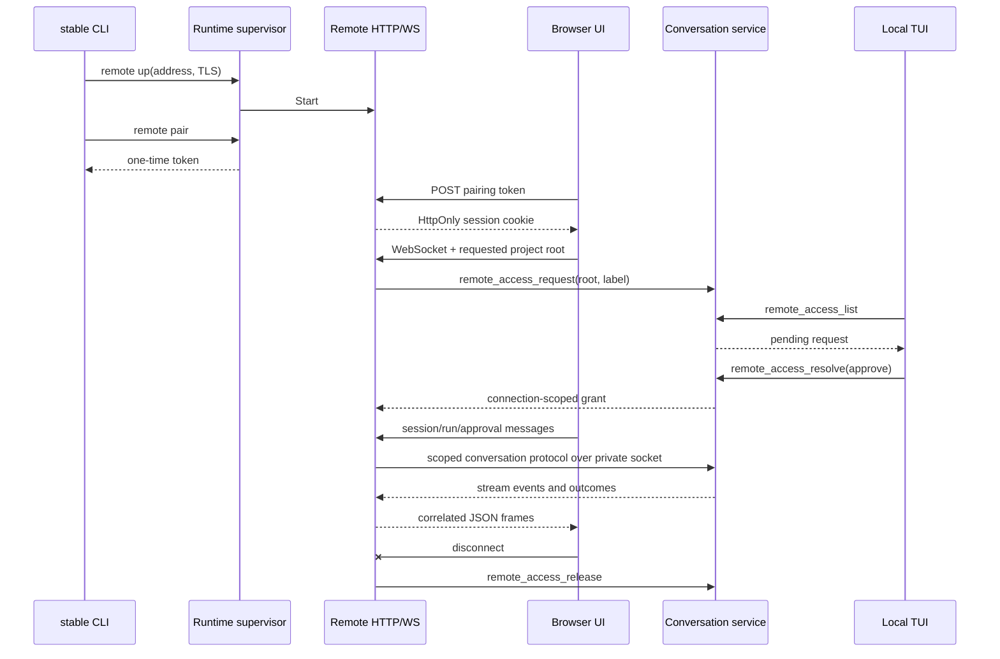

# M10-B WebSocket Remote 与浏览器会话 Plan

## 架构概览

Remote 与本机 runtime 同生命周期，由 supervisor 持有一个可启停的 remote manager。普通 runtime 启动不会开放 remote；`stable remote up` 向 supervisor 请求启动，`remote down` 只关闭 remote，`stable down` 结束 supervisor 时一并关闭 remote。`remote up` 若发现 runtime 未运行，先启动它。

Remote manager 使用 Go `net/http` 托管内嵌静态页面，并在同一 origin 下提供配对 HTTP endpoint 与 WebSocket endpoint。WebSocket 连接通过私有 conversation socket 转发现有会话协议；server 为每个连接管理内部 request/stream socket，并将 `ServerMsg` 帧用 request ID 返回浏览器。浏览器只使用服务端生成的会话状态和 permission bounds。

目录授权纳入 conversation service 的可信状态。每个已配对 WebSocket 请求目录时，service 创建短期 pending request；本机 TUI 轮询并弹窗显示客户端标识和规范化目录。批准后 service 发放随机、仅当前 WebSocket 连接有效的 grant。所有远程 session/run 请求必须携带 grant ID，service 从 grant 取出 project root 并校验消息中的 root 一致。断开时 remote manager 撤销 grant；等待超时、服务重启和 TUI 离线均拒绝。

本机 TUI 增加远程目录授权弹窗，不改变既有工具审批、计划审批和 ask_user 对话框。浏览器静态界面以原生 HTML/CSS/JavaScript module 实现并通过 `embed.FS` 打包，避免引入 Node 构建链；功能限定于已批准的会话、审批交互和目标只读状态。

## 核心数据结构与接口

### RemoteConfig

```go
type RemoteConfig struct {
    ListenAddr string
    TLSCert    string
    TLSKey     string
    PairTTL    time.Duration
    AccessTTL  time.Duration
}
```

`ListenAddr` 缺省为 `127.0.0.1:8765`。非 loopback 地址要求同时提供 TLS cert/key。CLI 将启动参数经受限的 runtime control 请求传给 supervisor，不把密钥或 pairing token 写入配置文件。

### PairingStore

```go
type PairingStore interface {
    Issue() (token string, expiresAt time.Time, err error)
    Consume(token string) (BrowserSession, error)
    Revoke(sessionID string)
}
```

token 用密码学安全随机数生成；内存中只保存带用途域分隔的 hash 和过期时间。`Consume` 原子地完成过期校验与单次消费。成功后生成随机浏览器 session ID，cookie 仅保存不可预测的 opaque value；服务端只保留其 hash。PairingStore 与会话摘要均只存在内存中，RemoteManager 停止或 runtime 退出/重启时清空；旧 cookie 随即失效，客户端重新配对。

### Conversation remote access operations

扩展 `conversation.ClientMsg` 与 service/TUI 协议：

```text
remote_access_request  → 等待本机批准并返回 RemoteGrant
remote_access_list     → 返回仍有效的 pending request
remote_access_resolve  → 本机 TUI 批准/拒绝 request
remote_access_release  → 撤销当前连接的 grant
```

```go
type RemoteAccessRequest struct {
    ID, ClientLabel, ProjectRoot string
    CreatedAt, ExpiresAt         time.Time
}

type RemoteGrant struct {
    ID, ProjectRoot string
    ExpiresAt       time.Time
}
```

service 在生成 request 前调用现有 `sessionRoot` 解析并 canonicalize 目录；grant 与单一 root/连接绑定。远程操作必须携带 `RemoteGrantID`，服务端根据 grant 覆盖/校验 project root，不信任浏览器传来的路径或 permission bounds。Release、disconnect、过期和 service 关闭都会使 grant 失效。

### WebSocket envelope

每个文本帧是有最大字节数限制的 JSON envelope；单帧最多 1 MiB，每个连接最多 16 个活动 request ID：

```json
{"id":"request-id","message":{"op":"session_list"}}
{"id":"request-id","message":{"type":"done"}}
```

request ID 仅用于复用一个 WebSocket 上的并行请求和区分 run stream。Remote handler 在本机为每个 request 建立 conversation IPC 连接；有限操作收到 `done` 后关闭该内部连接，run start/subscribe 保持到终态或浏览器断开。每个内部连接固定绑定该 WebSocket 的 grant ID。协议拒绝 binary frames、未识别 envelope 和超限消息。

### RemoteManager

```go
type RemoteManager interface {
    Start(context.Context, RemoteConfig) (Status, error)
    Stop(context.Context) error
    Status() Status
    IssuePairingToken() (token string, expiresAt time.Time, err error)
}
```

manager 负责 listener/TLS、配对存储、cookie session、Origin 验证、静态资源、帧限制、rate limit 和连接清理。配对请求 body 上限 16 KiB；最多 8 个并发 WebSocket 连接；同一来源地址配对失败达到每分钟 5 次后冷却 1 分钟。超限时用通用错误响应，避免泄漏 token 是否有效。TLS 私钥只由 Go TLS 层在 listener 初始化时读取，不返回给客户端。

## 模块设计

### `cmd/stable` 与 `internal/runtime`

CLI 增加 `remote up|down|status|pair`。`up` 接受 listen/cert/key；loopback 可省略证书，非 loopback 校验完整证书参数。`pair` 只在 remote 正常运行时签发并一次性打印短时 token。runtime 增加 typed remote-control request/result，supervisor 持有 manager 并处理 start/stop/status/pair；`stable down` 的 supervisor 收尾统一关闭 HTTP server 与所有 WebSocket 连接。

### `internal/remote`

新包包含 server、pairing store、会话认证、WebSocket bridge 和资源限制。`http.Server` 只监听 CLI 明确指定地址；TLS 使用 Go 标准库。所有请求检查 Host 与精确同源 Origin；配对 token 交换后设置 HttpOnly、SameSite=Strict cookie，HTTPS cookie 设置 Secure。`/ws` 只接受认证 cookie，调用 conversation remote access request；获得 grant 后转发协议。断开时撤销 grant、取消 run stream subscriber、关闭内部 IPC 连接并等待 goroutine 退出。

WebSocket 使用 `github.com/coder/websocket`，配合 `wsjson` 与 `SetReadLimit`。选择该库是因为其 API 支持 context、连接读写可并发、提供单消息大小限制且没有传递依赖；计划 pin 当前稳定版本 `v1.8.15`。官方项目文档：[coder/websocket README](https://github.com/coder/websocket)、[v1.8.15 API](https://pkg.go.dev/github.com/coder/websocket@v1.8.15)。

### `internal/conversation`

增加 remote access request 的内存状态、超时 waiter、grant registry 和协议 ops。request 创建后被 TUI 轮询读取；`remote_access_resolve` 只接受有效 pending ID。所有接受 remote grant 的 conversation 消息都通过统一 root resolver；普通本地 TUI 仍走原有 root 校验，两个授权来源不可相互扩大。会话和 run 仍由既有 store/sessionlog/runner 持久化。

### `internal/tui`

模型初始化和短周期 poll 增加 pending remote access 查询。新增高优先级弹窗显示 client label、canonical project root、过期时间，并提供批准/拒绝操作。即使当前 TUI session 不同于远程新 session，弹窗也可显示；request ID 不复用普通工具审批 ID。TUI 离线时 conversation service 只保留到 TTL，不作自动批准。

### 嵌入式浏览器 UI

`internal/remote/ui/` 包含 `index.html`、CSS 和 JavaScript module，以 `embed.FS` 提供。页面先完成配对，再连接 WebSocket；连接时提交项目目录和显示名。获得目录 grant 后，UI 使用现有 conversation op 结构呈现会话列表、transcript、文本流、run 取消、权限审批、计划审批、ask_user 和只读目标摘要。浏览器只存 cookie，不把配对 token 放进 localStorage、URL、日志或 WebSocket query string。

## 模块交互



## 文件组织

```text
cmd/stable/
├── main.go                 — remote CLI dispatch/help
├── remote.go               — remote flags and command output
└── remote_test.go          — CLI/runtime-control tests
internal/remote/
├── config.go               — listener defaults and TLS validation
├── manager.go              — lifecycle and HTTP server
├── auth.go                 — one-use pairing and cookie sessions
├── websocket.go            — origin checks and correlated bridge
├── ui/                     — embedded HTML/CSS/JS modules
└── *_test.go               — auth/transport/bridge tests
internal/runtime/
├── supervisor.go           — manager ownership and control operations
└── remote_control.go       — typed private control client/server requests
internal/conversation/
├── remote_access.go        — pending requests and connection grants
├── protocol.go             — remote access message fields/validation
└── service.go              — authorization routing and TTL cleanup
internal/tui/
├── model.go                — pending remote access state and polling
├── remote_access_dialog.go — local directory approval dialog
└── remote_access_test.go   — approve/deny/expiry behavior
```

## 技术决策

| 决策点 | 选择 | 理由 |
|---|---|---|
| Remote 生命周期 | 由现有 supervisor 管理，显式 `remote up/down`，`stable down` 随 supervisor 关闭 | 不新增孤儿 daemon；普通 runtime 启动不开放 listener |
| WebSocket 库 | `github.com/coder/websocket v1.8.15` | 官方 API 支持 context、并发读写和读限；比手写 RFC6455 framing 风险低 |
| 浏览器资源 | 原生 HTML/CSS/JS + `embed.FS`，同源托管 | 不增加 Node 构建/部署链和 CORS 面 |
| Browser authentication | 短时一次性配对 token 交换 opaque HttpOnly cookie；凭证仅内存保存 | token 不进 URL/localStorage；停止/重启后自动失效，避免持久凭证管理面 |
| 目录授权位置 | conversation service 持有 pending request/grant；TUI 批准 | client/browser 无法自行扩大 root；权限事实落在现有可信服务边界 |
| Grant 范围 | 单个 canonical root、单个 WebSocket 生命周期 | 对应“每次连接本机批准目录”，断开即失效 |
| Remote 资源限制 | body 16 KiB、帧 1 MiB、每连接 16 个活动请求、并发连接 8、配对失败 5 次/分钟后冷却 1 分钟 | 覆盖 HTTP、WebSocket、并发和配对暴力尝试；阈值由自动化测试验证 |
| 目标能力 | 远程仅读状态与最近事件 | 满足状态可见，同时不把目标控制/验收带入新网络面 |

## 关键风险与缓解

- **TUI 审批弹窗被别的弹窗遮挡：** remote access dialog 有明确高优先级；测试覆盖多种 pending dialogs 并存。
- **WebSocket 消息跨请求混淆：** 每帧带受长度限制的随机/客户端 request ID；服务端拒绝重复活动 ID，并固定内部 socket 到同一 grant。
- **断线后授权泄露：** handler defer 撤销 grant、取消 stream subscriber 并关闭 IPC；conversation grant 同时带硬过期时间。
- **TLS/Origin 配置错误暴露：** 非 loopback 需要 TLS；host 与 origin 精确校验；启动或握手配置不符时 fail closed。
- **端口和多连接测试不稳定：** 测试使用 `127.0.0.1:0` 和临时 state dir，不启动 Temporal 或真实 provider。

## 设计覆盖自检

| Spec 项 | 设计归属 |
|---|---|
| F1/F2 remote 生命周期与 TLS | runtime supervisor、RemoteManager、CLI |
| F3/F4 配对、Origin、密钥保护 | `internal/remote/auth.go`、`websocket.go` |
| F5 本机逐连接目录批准 | conversation grant registry + TUI 弹窗 |
| F6/F7 session/run/权限交互 | WebSocket bridge + conversation service + browser UI |
| F8 目标只读显示 | browser UI 通过已授权会话状态查询 |
| F9 管理功能不暴露 | remote protocol allowlist 与 UI 页面导航 |
| N1–N5 安全、资源与验证 | 每层 fail-closed 校验及 auth/transport/integration tests |
